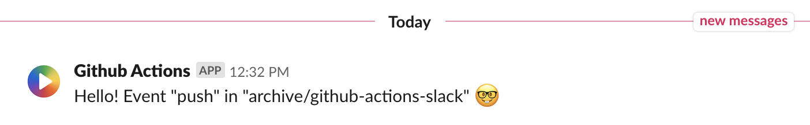
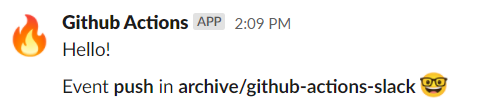
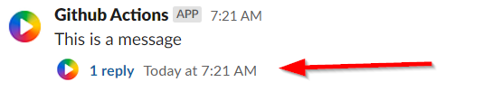
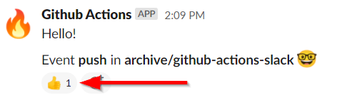
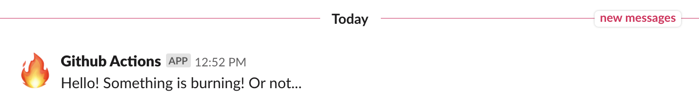
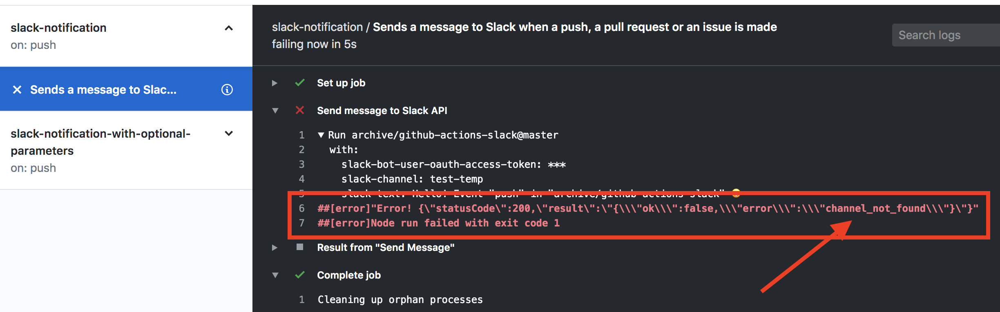

# Github Action for sending message (and reactions/threads/update/blocks) to Slack

— With support for Slack's optional arguments


This Action allows you to send messages (and reactions/threads/update/blocks) to Slack from your Github Actions. Supports Slack's required arguments as well as all the optional once. It's JavaScript-based and thus fast to run.

The goal is to have zero npm/yarn dependencies except the two from Github that is required for an action to work (@actions/core & @actions/github).



This action is just an HTTPS call to Slack API, so you can easily build this by yourself, or use this action or any one of the hundred other Slack actions available.

## Requirements

1. Slack Workspace and Channel(s)
1. A Slack App and Bot - the App and Bot will be used to send messages to your channel. It sounds hard, but it's not :)
1. A Github Action - the place where you wants to send Slack messages
1. Github Secret - the Slack Bot auth token, used when posting messages to Slack API

## Important

With the latest changes to Slack API, please use channel id instead of channel name. E.g. use `CPPUV5KU0` instead of `test` (You can find the ID in the API calls or https://stackoverflow.com/questions/40940327/what-is-the-simplest-way-to-find-a-slack-team-id-and-a-channel-id)

## Setup

This action supports:

- 1. Send messages<br>
     

- 2. Send thread response to message<br>
     

- 3. Send reaction on sent messages<br>
     

## 1. Send messages to Slack

**Required: Github Repository Secret:**

- `SLACK_BOT_USER_OAUTH_ACCESS_TOKEN` - This is the Slack App token, the credentials for allowing you to send messages from github to Slack

**Required: Github Action Parameters:**

- `slack-bot-user-oauth-access-token` - `SLACK_BOT_USER_OAUTH_ACCESS_TOKEN` secret

- `slack-channel` - The channel/channels where you want the message (comma separated)

- `slack-text` - The text of the message (or use `slack-optional-blocks`)

**Optional: Github Action Parameters:**

All the optional parameters that Slack supports, can be sent via the `slack-optional-xxx` parameter.

| Slack parameter name | Yaml parameter name         |
| -------------------- | --------------------------- |
| `icon_emoji`         | `slack-optional-icon_emoji` |
| `link_names`         | `slack-optional-link_names` |

and so forth.

Please see Slack API documentation for all available optional parameters: https://api.slack.com/methods/chat.postMessage

**Result / return value**

- `slack-result` (.outputs.slack-result) - Contains the result of the sent message. This can be used for following steps like sending a reaction

Sample `slack-result`:

```
{
  "statusCode": 200,
  "statusMessage": "OK",
  "ok": true,
  "result": "<deprecated - same as response but as string>",
  "response": {
    "ok": true,
    "channel": "XXXX",
    "ts": "1612623790.009600",
    "message": {
      "type": "message",
      "subtype": "bot_message",
      "text": "Lipsum",
      "ts": "1612623790.009600",
      "username": "Lipsum",
      "bot_id": "XXXX"
    }
  }
}
```

If you want to output or debug the result, add:

```
      - name: Send Slack Message Result
        run: echo "${{ steps.send-message.outputs.slack-result }}"
```

- `slack-results` (.outputs.slack-results) - Contains an array of all the results when sending to multiple channels. This can be used for following steps like sending a reaction. See [.github/workflows/7-slack-notification-multi-channel.yml](.github/workflows/7-slack-notification-multi-channel.yml)

### Sample Action file with Slack Channel and Text

[.github/workflows/2-slack-notification.yml](.github/workflows/2-slack-notification.yml)

This will send a Slack message every time someone push, creates pull request or create an issue

```
name: slack-notification

on: [push, pull_request, issues]

jobs:
  slack-notifications:
    runs-on: ubuntu-20.04
    name: Sends a message to Slack when a push, a pull request or an issue is made
    steps:
      - name: Send message to Slack API
        uses: archive/github-actions-slack@v2.0.0
        id: notify
        with:
          slack-bot-user-oauth-access-token: ${{ secrets.SLACK_BOT_USER_OAUTH_ACCESS_TOKEN }}
          slack-channel: CPPUV5KU0
          slack-text: Hello! Event "${{ github.event_name }}" in "${{ github.repository }}" 🤓
      - name: Result from "Send Message"
        run: echo "The result was ${{ steps.notify.outputs.slack-result }}"
```


### Sample Action file with Slack optional parameters

[.github/workflows/2-slack-notification.yml](.github/workflows/2-slack-notification.yml)

```
name: slack-notification-with-optional-parameters

on: [push, pull_request, issues]

jobs:
  slack-notification-with-optional-parameters:
    runs-on: ubuntu-20.04
    name: Sends a message to Slack when a push, a pull request or an issue is made
    steps:
      - name: Send message to Slack API
        uses: archive/github-actions-slack@v2.0.0
        id: notify
        with:
          slack-bot-user-oauth-access-token: ${{ secrets.SLACK_BOT_USER_OAUTH_ACCESS_TOKEN }}
          slack-channel: CPPUV5KU0 #USE CHANNEL ID, NOT CHANNEL NAME, SINCE ID IS USED IN NEW SLACK API's
          slack-text: Hello! Something is burning! Or not...
          slack-optional-icon_emoji: ":fire:"
      - name: Result from "Send Message"
        run: echo "The result was ${{ steps.notify.outputs.slack-result }}"
```



## 2. Send thread response to message to Slack

To send a thread response you have the same setup as for sending a message, but you add some extra optional parameters:

- `slack-optional-thread_ts` - The timestamp of the message you want to reply/send thread to. You can find the timestamp in the response payload after sending a message

- `slack-optional-reply_broadcast` - To broadcast thread reply in channel

### Sample Action file

[.github/workflows/4-slack-thread.yml](.github/workflows/4-slack-thread.yml)

See `Send Thread Message` part below:

```
name: slack-thread

on: [push, issues]

jobs:
  slack-thread:
    runs-on: ubuntu-20.04
    name: Sends a message to Slack when a push, a pull request or an issue is made

    steps:
      - name: Send Slack Message
        uses: archive/github-actions-slack@master
        id: send-message

        with:
          slack-function: send-message
          slack-bot-user-oauth-access-token: ${{ secrets.SLACK_BOT_USER_OAUTH_ACCESS_TOKEN }}
          slack-channel: CPPUV5KU0
          slack-text: This is a message

      - name: Send "Slack Message" Result
        run: echo "Data - ${{ steps.send-message.outputs.slack-result }}"

      - name: Some step in between
        run: echo "..."

      - name: Send Thread Message
        uses: archive/github-actions-slack@master
        with:
          slack-function: send-message
          slack-bot-user-oauth-access-token: ${{ secrets.SLACK_BOT_USER_OAUTH_ACCESS_TOKEN }}
          slack-channel: ${{ fromJson(steps.send-message.outputs.slack-result).response.channel }}
          slack-text: This is a thread reply
          slack-optional-thread_ts: ${{ fromJson(steps.send-message.outputs.slack-result).response.message.ts }}
          #slack-optional-reply_broadcast: true # To broadcast thread reply in channel

      - name: Send "Send Thread Message" Result
        run: echo "Data - ${{ steps.send-message.outputs.slack-result }}"

```


## 3. Send reaction on sent messages to Slack

**Required: Github Repository Secret:**

- `SLACK_BOT_USER_OAUTH_ACCESS_TOKEN` - This is the Slack App token, the credentials for allowing you to send messages from github to Slack

**Required: Github Action Parameters:**

- `slack-bot-user-oauth-access-token` - `SLACK_BOT_USER_OAUTH_ACCESS_TOKEN` secret

- `slack-channel` - The channel where you want the message. You can find the channel id in the response payload after sending a message

- `slack-emoji-name` - The name of the emoji to send (e.g. "fire"/"thumbsup")

- `slack-message-timestamp` - The unique ts/timestamp of the message you want to react to. You can find the timestamp in the response payload after sending a message

**Result / return value**

- `slack-result` (.outputs.slack-result) - Contains the result of the sent reaction

### Sample Action file with Slack Channel and Text

[.github/workflows/3-slack-reaction.yml](.github/workflows/3-slack-reaction.yml)

This will send a Slack message every time someone push, creates pull request or create an issue, and then, create a reaction to it

```
name: slack-reaction

on: [push, issues]

jobs:
  slack-reaction:
    runs-on: ubuntu-20.04
    name: Sends a message to Slack when a push, a pull request or an issue is made

    steps:
      - name: Send Slack Message
        uses: archive/github-actions-slack@v2.0.0
        id: send-message

        with:
          slack-function: send-message
          slack-bot-user-oauth-access-token: ${{ secrets.SLACK_BOT_USER_OAUTH_ACCESS_TOKEN }}
          slack-channel: CPPUV5KU0
          slack-text: Time to react...

      - name: Send Slack Message Result
        run: echo "Data - ${{ steps.send-message.outputs.slack-result }}"

      - name: Some step in between
        run: echo "..."

      - name: Send Slack Reaction To Message
        uses: archive/github-actions-slack@v2.0.0
        with:
          slack-function: send-reaction
          slack-bot-user-oauth-access-token: ${{ secrets.SLACK_BOT_USER_OAUTH_ACCESS_TOKEN }}
          slack-channel: ${{ fromJson(steps.send-message.outputs.slack-result).response.channel }}
          slack-emoji-name: thumbsup
          slack-message-timestamp: ${{ fromJson(steps.send-message.outputs.slack-result).response.message.ts }}

      - name: Send Slack Reaction To Message Result
        run: echo "Data - ${{ steps.send-message.outputs.slack-result }}"
```


## 4. Update message

Similar to Add Reaction, but with text instead.

Please see [.github/workflows/5-slack-update-message.yml](.github/workflows/5-slack-update-message.yml)

## 5. Using blocks

With blocks you can create more rich and complex messages / message layouts: https://api.slack.com/messaging/composing/layouts


For some examples, please see:

- [.github/workflows/11-slack-message-blocks.yml](.github/workflows/11-slack-message-blocks.yml)
- [.github/workflows/12-slack-message-blocks-update.yml](.github/workflows/12-slack-message-blocks-update.yml)

## How to setup your first Github Action in your repository that will call this Action

### 1. Create a Slack bot

Follow this guide on how to create a Slack App and Bot for your workspace:

- https://slack.com/intl/en-se/help/articles/115005265703-create-a-bot-for-your-workspace

You should:

1. Create a new Slack App, https://api.slack.com/apps?new_app=1
1. Go to "Basic Information" > "Display Information" > "App icon & Preview" and add avatar for you App. This will be shown in Slack when you receive messages
1. Go to "Bot User" > "Add" and add a bot user to your Slack App
1. Go to "Install App" > "Install App to Workspace" to install your Slack App into your Slack workspace
1. Done

### 2. Save Bot Access Token on Github

To be able to send messages to slack, the Action needs the Auth Token for the Slack App. Since the Auth Token is sensitive information, you should NOT place it in the yaml file of the Action, but instead in the Github Secrets area.

1. Go to your App on Slack, https://api.slack.com/apps/
1. Go to "OAuth & Permissions" > "Bot User OAuth Access Token"
1. Copy the `Bot User OAuth Access Token`
1. Go to your Github Repo
1. Go to "Settings" > "Secrets" for the repo
1. Create a new secret called `SLACK_BOT_USER_OAUTH_ACCESS_TOKEN` with the value from `Bot User OAuth Access Token`
1. Done

### 2. Create a new Github Action

1. Go to your github repo
1. Go to actions
1. Create a new one, you can use the samples above

## Q&A

### It's not working

Please look at the individual steps on your Github Action. Maybe you have forgotten to set Channel or Token:



To debug action and see what payload is being sent to slack, enable debugging: https://docs.github.com/en/actions/configuring-and-managing-workflows/managing-a-workflow-run#enabling-debug-logging (`ACTIONS_RUNNER_DEBUG=true` and `ACTIONS_STEP_DEBUG=true` under `Settings > Secrets`)

### What information about the repo etc is available?

You can easily print everything you have while running the action. It can be a good way to see what you can send to Slack.

```
on: push

jobs:
  one:
    runs-on: ubuntu-20.04
    steps:
      - name: Dump GitHub context
        env:
          GITHUB_CONTEXT: ${{ toJson(github) }}
        run: echo "$GITHUB_CONTEXT"
      - name: Dump job context
        env:
          JOB_CONTEXT: ${{ toJson(job) }}
        run: echo "$JOB_CONTEXT"
      - name: Dump steps context
        env:
          STEPS_CONTEXT: ${{ toJson(steps) }}
        run: echo "$STEPS_CONTEXT"
      - name: Dump runner context
        env:
          RUNNER_CONTEXT: ${{ toJson(runner) }}
        run: echo "$RUNNER_CONTEXT"
      - name: Dump strategy context
        env:
          STRATEGY_CONTEXT: ${{ toJson(strategy) }}
        run: echo "$STRATEGY_CONTEXT"
      - name: Dump matrix context
        env:
          MATRIX_CONTEXT: ${{ toJson(matrix) }}
        run: echo "$MATRIX_CONTEXT"
```

From: https://help.github.com/en/github/automating-your-workflow-with-github-actions/contexts-and-expression-syntax-for-github-actions

### Why JavaScript and not Shell/etc?

_"JavaScript actions can run directly on any of the GitHub-hosted virtual machines, and separate the action code from the environment used to run the code. Using a JavaScript action simplifies the action code and executes faster than a Docker container action."_
(https://help.github.com/en/github/automating-your-workflow-with-github-actions/about-actions)

### How does the Action JavaScript code work

It's simple, it just takes all the parameters and does an HTTPS POST to api.slack.com.

### I want another avatar to be used in Slack

By default the avatar in Slack will be the same as for the Slack App you created. If you want to change this based on action, look at the https://api.slack.com/methods/chat.postMessage `icon_emoji` parameter.

### Why did you build your own?

It was a good way to learn more about Github Actions

### Why should I use this?

This action is just an HTTPS POST to Slack API, so you can easily build this by yourself, or use this, or use any other action available on the marketplace :)

## Development and testing

See package.json for `yarn lint`, `yarn test`, etc.

Remember to create the dist with `yarn build`.

To run local integration test (from this repository):

```
env BOT_USER_OAUTH_ACCESS_TOKEN=<YOUR TOKEN> CHANNEL=<YOUR CHANNEL> node integration-test/end-to-end.js
```
